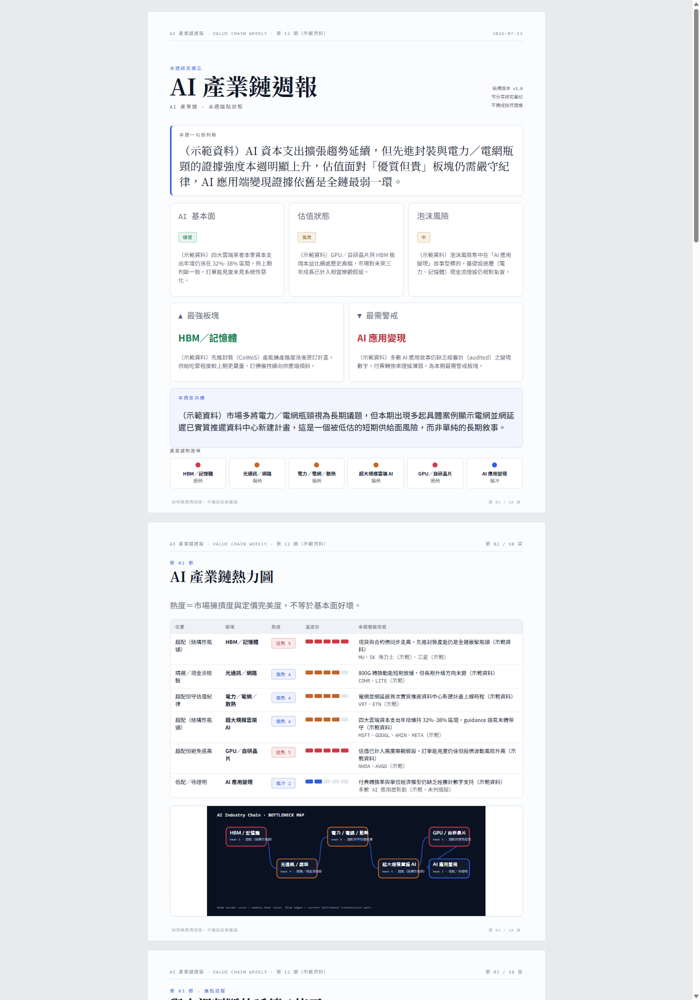
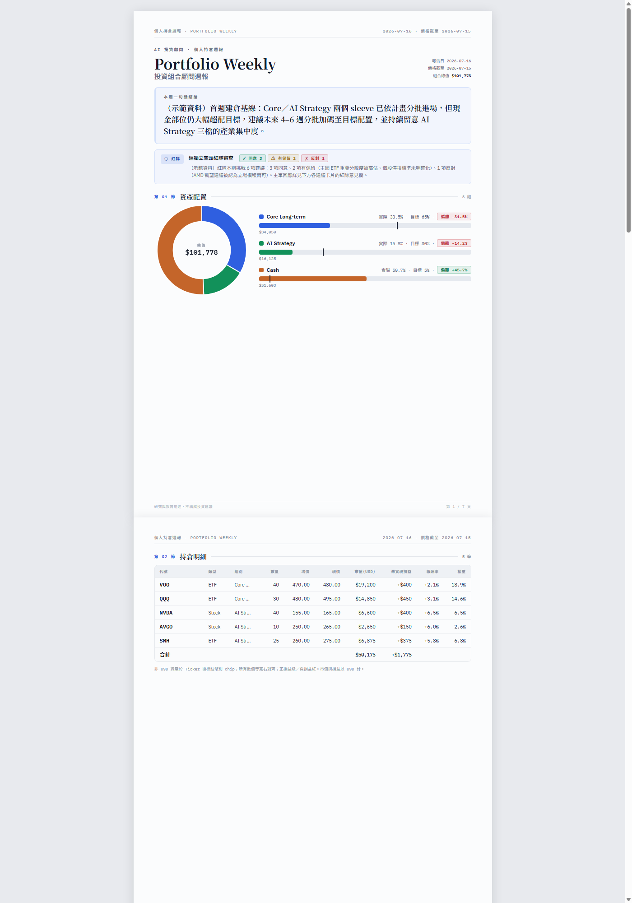
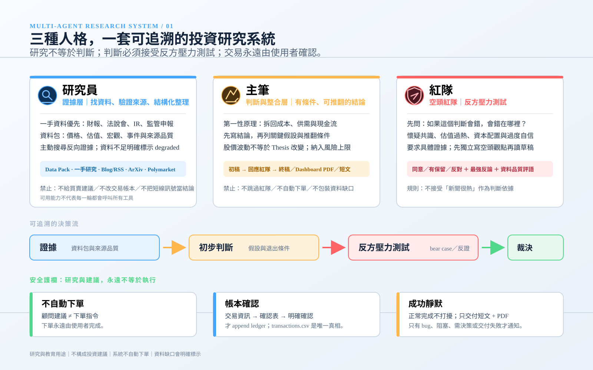
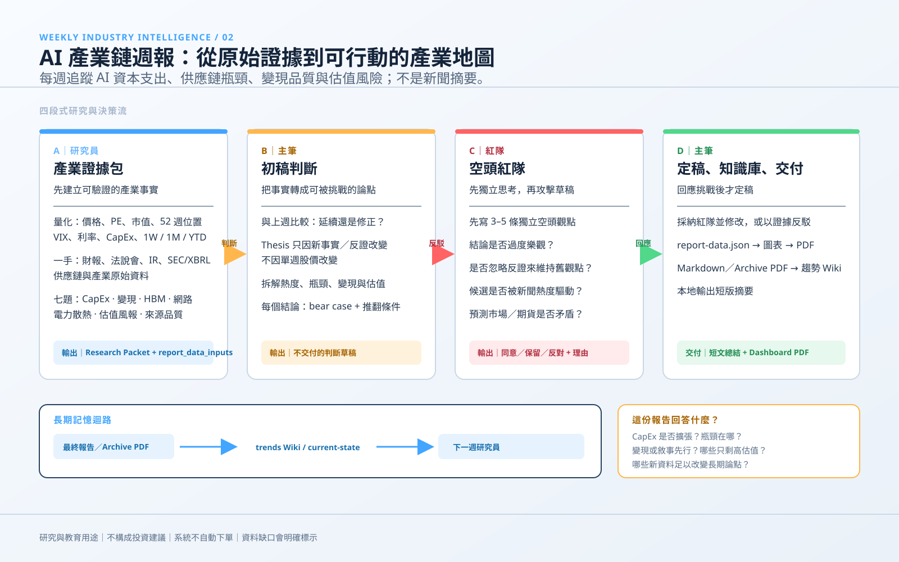
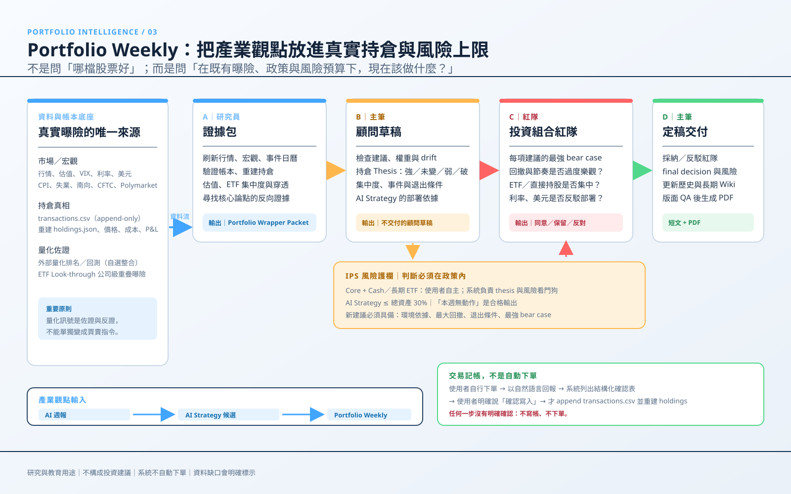

# 屬於你自己的投資顧問

*your-own-investment-advisor*

一個給只有 **$20 Claude Pro 或 ChatGPT Plus 訂閱 + 桌面版 agent（Claude Cowork / Claude Code / Codex）** 的朋友，不需要任何額外基礎建設（沒有伺服器、沒有 API key、沒有資料庫），就能在自己電腦上跑起來的私人投研系統。整個系統就是這個資料夾：你把它交給桌面 agent，agent 讀完 `AGENTS.md` 或 `skills/*/SKILL.md` 就知道怎麼幫你做研究、寫報告、記帳。所有資料都留在你自己的電腦上。

## 你每週會收到什麼

兩條 pipeline 每次執行完，都會在 `outputs/` 底下留下一份帶圖表的 HTML 報告（找得到瀏覽器的話會多一份可搜尋 PDF），外加一段可以直接轉發的短版摘要。以下是本 repo 內建的**示範資料**（`examples/`，非真實市場資訊，僅供展示排版與結構）：

- **AI 產業鏈週報**：[dashboard HTML](examples/ai-weekly-demo/2026-07-13/2026-07-13-dashboard.html) ・[dashboard PDF](examples/ai-weekly-demo/2026-07-13/2026-07-13-dashboard.pdf) ・[Archive HTML](examples/ai-weekly-demo/2026-07-13/2026-07-13-archive.html)（完整研究記錄，含 agent 用 yfinance 現場計算的量化因子快照）
- **Portfolio Weekly（投資組合週報）**：[dashboard HTML](examples/portfolio-demo/2026-07-16-portfolio-dashboard.html) ・[dashboard PDF](examples/portfolio-demo/2026-07-16-portfolio-dashboard.pdf)（含持倉量化因子與簡單回測 vs SPY）

截圖預覽（點圖可看完整 HTML/PDF）：

　

## 系統長怎樣

三張資訊圖說明系統的分工、決策流與兩條 pipeline 各自的運作方式（點圖可看完整大圖）：

| | |
|---|---|
|  |  |
| **①角色分工與安全護欄**：研究員／主筆／紅隊三段角色如何互相制衡，以及「不自動下單」「帳本需明確確認」「成功靜默」三條護欄。 | **②AI 產業鏈週報流程**：研究員蒐證 → 主筆下判斷 → 紅隊獨立攻擊 → 主筆定稿交付的四段流程。 |

**③Portfolio Weekly 流程**：以你自己的帳本與 investment-policy 為風險護欄，把產業觀點轉成具體的持倉建議，同一套四段角色流程再跑一次。

> 三張圖中的「研究員 / 主筆 / 紅隊」是角色代稱，不是三個不同的 AI —— 實際上是你自己的 agent 依序扮演每個角色，只有紅隊那一段需要在隔離的新對話 / subagent 裡執行（見下方模組介紹）。

## 快速開始（3 步）

1. **訂閱 + 裝好桌面版 agent**：Claude Pro（裝 Claude 桌面版或 Claude Code）或 ChatGPT Plus（裝 Codex 桌面版或 CLI）擇一即可，兩邊都支援。
2. **取得本 repo**：`git clone` 這個 repo，或直接下載 zip 解壓縮到你電腦上任一資料夾。
3. **打開資料夾、對 agent 說「讀 README 幫我完成安裝」**：agent 會自動找到 `AGENTS.md`（Codex）或 `skills/*/SKILL.md`（Claude）並依裡面寫的 onboarding 步驟，幫你檢查 Python 環境、跑一次 smoke test、問你要不要客製產業或建立你自己的持倉帳本。詳細平台設定見下方 docs。

## 兩個模組

### ai-weekly — AI 產業鏈週報

每週追蹤一次 AI 產業鏈現況（資本支出、供應鏈瓶頸、變現品質、估值風險），產出帶熱力圖與圖表的完整報告 + 短版摘要。預設產業是「AI 產業鏈」，可自訂換成任何你想追蹤的產業。

觸發語範例：「跑本週週報」「產出這週的 AI 產業週報」「這週 AI 產業有什麼變化」

入口文件：[`skills/ai-weekly/SKILL.md`](skills/ai-weekly/SKILL.md)（Claude）／[`AGENTS.md`](AGENTS.md)（Codex）

### portfolio-advisor — 投資組合週報 + 記帳

對你自己的持倉每週做一次顧問流程（狀態檢查、buy/sell 建議、風險檢查），外加隨時可用的自然語言記帳流程（口頭報交易 → agent 整理成確認表 → 你明確確認後才寫入帳本）。

觸發語範例：「跑本週 Portfolio Weekly」「我買了 X」「我入金了 10000 美金」「初始化我的投資組合」

入口文件：[`skills/portfolio-advisor/SKILL.md`](skills/portfolio-advisor/SKILL.md)（Claude）／[`AGENTS.md`](AGENTS.md)（Codex）

## 自訂產業

ai-weekly 預設追蹤「AI 產業鏈」，但整條 pipeline（研究提示詞、渲染腳本、圖表）都是讀 `ai-weekly/industry-config.yaml` 驅動的，換成任何產業都不需要改程式碼。直接對 agent 說「我要換成半導體設備產業週報」之類的話，agent 會照著訪談你並改寫設定檔。細節見 [`docs/customize-industry.md`](docs/customize-industry.md)。

## 隱私設計

- **帳本只在你自己的電腦上**：`portfolio-advisor/portfolio/`（你的真實持倉、交易紀錄、投資政策）與 `outputs/`（每次執行產出的報告）都已列在 `.gitignore`，不會被提交、不會離開你的電腦。
- **repo 內建的資料全是虛構示範資料**：`examples/` 底下的持倉、交易、報告內容都是為了展示排版與流程而編造的，不是任何真實帳戶或市場資料。
- 系統本身不呼叫任何需要 API key 的第三方服務；研究資料來自 agent 內建的網頁搜尋能力。

## 免責聲明

> **本報告僅供研究與教育用途，不構成投資建議；最終決策與下單由使用者本人完成。** 系統不會自動下單，任何寫入帳本的交易都需要你本人明確確認。所有判斷可能出錯，讀者需自行盡職調查。

## 文件索引

- [`docs/install-claude.md`](docs/install-claude.md) — Claude（Cowork / Claude Code）安裝與環境設定
- [`docs/install-codex.md`](docs/install-codex.md) — Codex（桌面版 / CLI）安裝與環境設定
- [`docs/customize-industry.md`](docs/customize-industry.md) — 如何把 ai-weekly 換成別的產業
- [`docs/faq.md`](docs/faq.md) — 常見問題（用量、離線降級、資料來源、排程、進階數據層…）
- [`docs/pitch.md`](docs/pitch.md) — 一頁式分享文（轉發給朋友用）
- [`AGENTS.md`](AGENTS.md) — Codex 端完整操作指南（兩模組的完整流程細節）
- [`skills/ai-weekly/SKILL.md`](skills/ai-weekly/SKILL.md) / [`skills/portfolio-advisor/SKILL.md`](skills/portfolio-advisor/SKILL.md) — Claude 端對應入口
